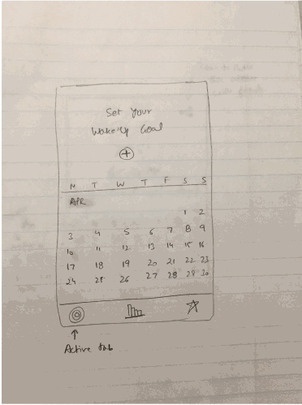

# ConnectedAlarmApp
iOS alarm app to connect and motivate each other to wake up early...

### Wireframes

https://github.com/iOSBootcamp2017-Team7/ConnectedAlarmApp/blob/master/Wireframes%20-%20Connected%20Alarm%20App.pdf

### Required Stories

- [ ] Ability to create shared alarm challenge
  - [ ] Duration
  - [ ] Purpose? / Reason for challenge?
  - [ ] Make the challenge private
- [ ] Ability to trigger alarm at the specified time
  - [ ] Shake to snooze the alarm
  - [ ] Maintain points - 4 pt system
- [ ] Ability to invite friends to shared alarm challenge
  - [ ] Ability to join a shared/invited alarm challenge
  - [ ] Ability to access your contacts
  - [ ] Ability to identify the list of contacts who has this app
  - [ ] Ability to invite users on the app or send SMS/iMessage to users not on the app
- [ ] Ability to track user did not snooze or went back to bed
  - [ ] Brainstorm ways to track user activity
- [ ] Ability to identify user
  - [ ] Whatsapp way to identify via phone #
  - [ ] or, OAuth to identify user
- [ ] Backend server to implement the connected logic

### Optional Stories

- [ ] Weekly / Monthly report on your progress
- [ ] Add reward system / ranking system
  - [ ] Badge system
- [ ] Make the challenge public
- [ ] Ability to join a public alarm challenge 
- [ ] Ability to track/input what you did after wake up?

### If successful?

- [ ] Ads catering the purpose of the shared alarm
- [ ] Pro/paid version
- [ ] Support Android

### Research Stories - How to?

- [ ] Backend technology?
  - [ ] Parse - Wei/Puneet
- [ ] How to access contacts on your phone? - Wei
- [ ] How to identify from your contacts who has our app? - Wei
- [ ] How to send SMS/push for free - Puneet
- [ ] How to access app user details - Puneet
- [ ] How to identify if user has woken up? - Uttam
  - [ ] Game - catch a pig?
  - [ ] Steps?

### Action Items

- [ ] Create a new project - Puneet
- [ ] Upload wireframes to MockingBot - Puneet

### App Considerations

- What is your product pitch?
  - Start with a problem statement and follow up with a solution.
  - Focus on engaging your audience with a relatable need.
- Who are the key stakeholders for this app?
  - Who will be using this?
  - What will they be using this for?
- What are the core flows?
  - What are the key functions?
  - What screens will each user see?
- What will your final demo look like?
  - Describe the flow of your final demo
- What mobile features do you leverage?
  - Leverage at least two mobile-oriented features i.e maps and camera
- What are your technical concerns?
  - What technical features do you need help or resources for?
